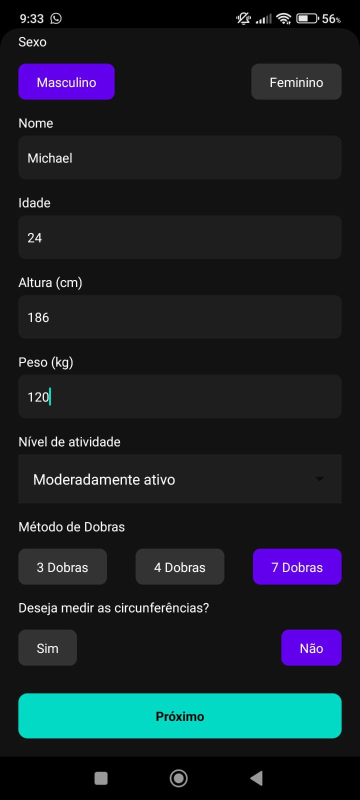
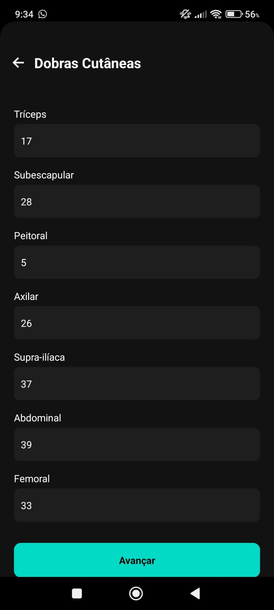
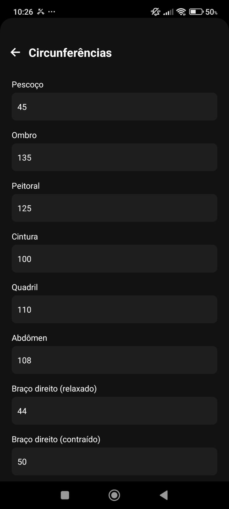
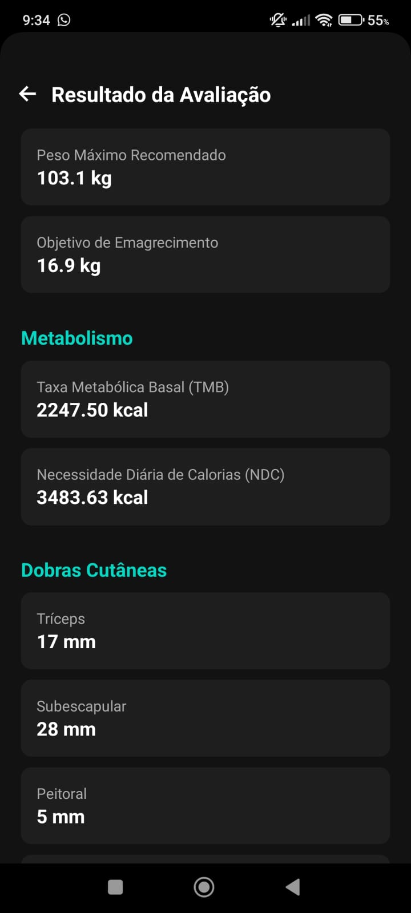
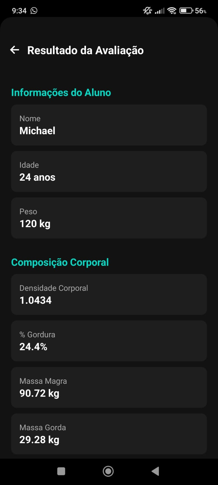
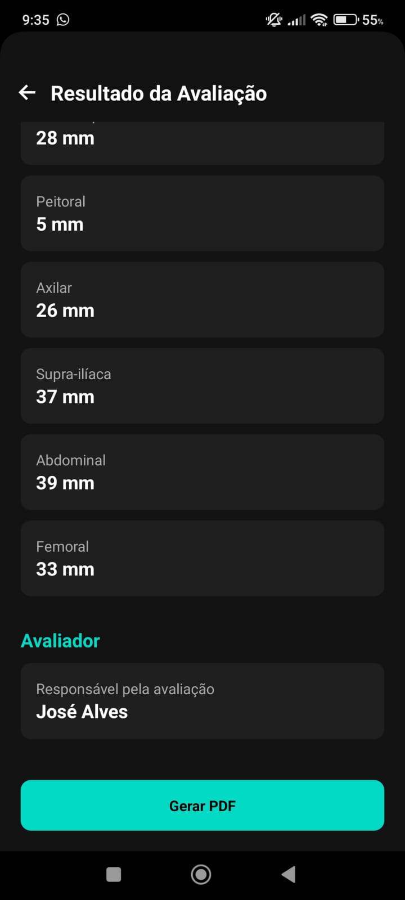
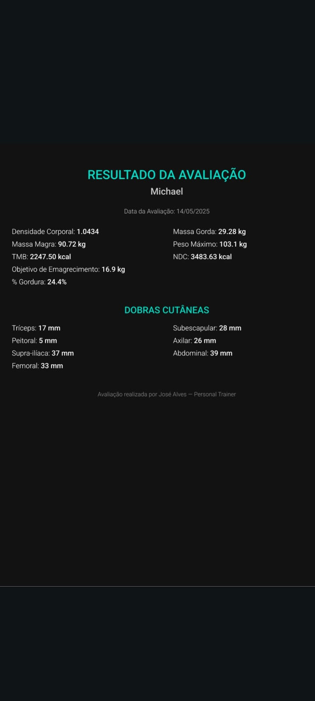
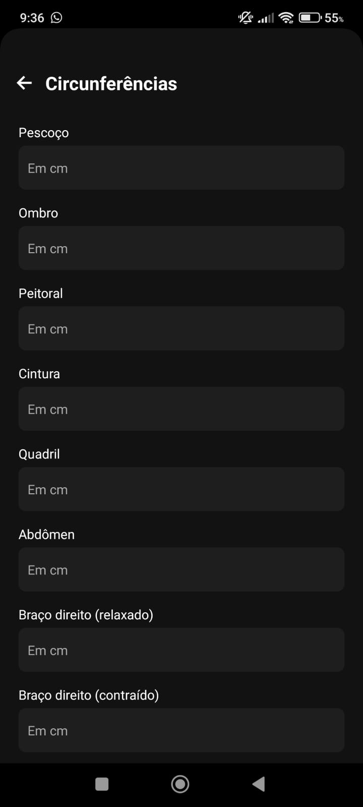

# 🏋️‍♂️ App de Avaliação Física - Personal Trainer

Aplicativo mobile para avaliação física de alunos com geração de relatórios em PDF, cálculo de composição corporal, TMB, NDC, e opção de incluir circunferências. Criado para uso por profissionais da área com interface dark e visual moderno.

## 🔥 Funcionalidades

- Avaliação física com 3, 4 ou 7 dobras cutâneas
- Entrada opcional de circunferências
- Cálculo de:
  - Densidade corporal
  - % Gordura, Massa Magra e Massa Gorda
  - TMB e NDC com base no nível de atividade
  - Peso máximo recomendado
- Geração de PDF escuro com identidade visual do personal trainer
- Armazenamento local e funcionalidade offline
- Compartilhamento fácil por WhatsApp, e-mail, etc

## 📲 Screenshots

| Entrevista Inicial | Escolha de método | Dobras Cutâneas |
|--------------------|-------------------|------------------|
|  |  |  |

| Circunferências 1 | Circunferências 2 | Resultado |
|------------------|-------------------|-----------|
|  |  |  |

| Geração do PDF | Compartilhamento | PDF Final |
|----------------|------------------|-----------|
|  |  |  |

## 🚀 Tecnologias

- React Native (Expo)
- TypeScript
- Styled Components
- Context API
- `expo-print`, `expo-sharing`
- `react-native-svg` + `react-native-view-shot`

## 📦 Como executar

```bash
npm install
npx expo start
